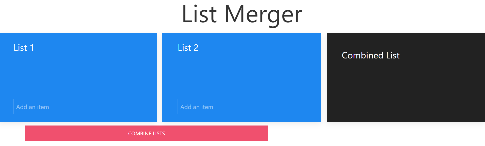

# List Merge App

## Description
A simple web app to streamline the combination of two lists. 

## Table of Contents

* [Technologies Used](#technologies-used)

* [How to Use](#how-to-use)     

* [How and Why I Made This](#how-and-why-i-made-this)  

* [Deployed Application](#link-to-deployed-application)

* [GitHub Repo](#link-to-github-repo)

* [Future Development Ideas](#future-development-ideas)  

## Technologies Used    
Built in Visual Studio with            
HTML         
CSS  
UIkit      
Javascript             

## How to Use      
Navigate to https://alyssahellrung.github.io/listMergeApp.  
You will see three empty boxes where lists will eventually go.  
  
Add some grocery items to List 1. Entries are not case-sensitive.        
     
Add some items to List 2 (or, better yet, ask someone else to make their own grocery list in List 2).  
       
When you click the "Combine Lists" button, you will see List 1 and List 2 appear in the "Combined List" box with no duplicates.
  
         

## How and Why I Made This      
My wife and I often make separate grocery lists when we notice foods or products are running low. Inevitably, she will have things on her list that are not on mine, and just as inevitably, a lot of the items are on both of our lists. Whoever needs to do the shopping then has to take both lists and combine them, weeding out the duplicates. So I made an app to do that combining task for us!  

To do this, I designed the main function (the one that combines two arrays) first. Then I figured out the frontend and DOM manipulation aspect. Finally, I got the entered List 1 and List 2 information into their own arrays and was able to use my listMerge() function from there to produce a combined (but curated) list that appears on the page.   

## Link to Deployed Application    
https://alyssahellrung.github.io/listMergeApp    

## Link to GitHub Repo        
https://github.com/alyssahellrung/listMergeApp  

## Future Development Ideas       
--This list doesn't work with quantities. So if someone had 3 apples on their list and the other person had 2 apples, it wouldn't know what to do with that. I need to figure out how to make the combined list default to whichever quantity of an item is higher.    
--Ideally, this would be a mobile app. Each person could make a list on their phone and push a button that would merge the two apps (from whichever phones they are on) and have the new combined list show up on both phones.    